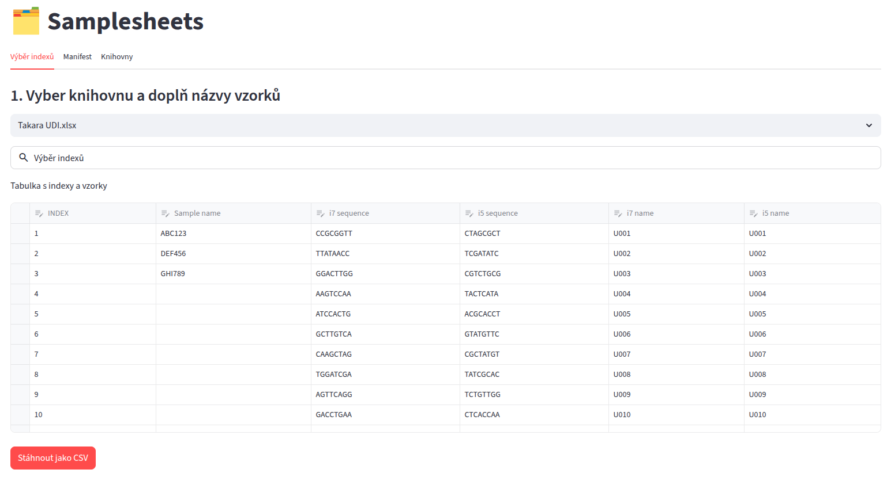

# AVITI Samplesheets App

Streamlit aplikace pro přípravu **samplesheetů** a práci s indexovými knihovnami AVITI.
Umožňuje:

- interaktivní výběr indexů z knihoven a filtrování
- přiřazení názvů vzorků a export tabulek do csv/xlsx
- generování samplesheetu s hlavičkou
- kontrolu duplicity indexů (i7 + i5) na stejné lane
- zobrazení informací o knihovnách

---

## Instalace balíčků
pip install -r requirements.txt

## Spuštění aplikace
Aplikace se otevře v prohlížeči na adrese:
[http://localhost:8501](http://localhost:8501)

## Použití

### 1. Výběr indexů
- Vyber knihovnu z nabídky (`libraries/*.xlsx`).
- Filtruj podle `INDEX`, `i7 name`, `i5 name`.
- Přidej názvy vzorků (lze i kopírovat Ctrl+V po více názvech).
- Exportuj jako `samples.csv` (volitelné).

### 2. Manifest (samplesheet)
- Zadej počet vzorků (tolik se přidá řádků v tabulce).
- Doplň názvy a indexy - zkopíruj z tabulky pro výběr indexů.
- Kontrola duplicit se provádí automaticky a v případě duplicity Tě upozorní.
- Export je možný do `.csv` nebo `.xlsx`.

### 3. Knihovny
- Zobrazení informací o jednotlivých knihovnách z `helps/info.txt`.

---

Enjoy!

 

🍬 2025 · [@AnnBeny](https://github.com/AnnBeny)

